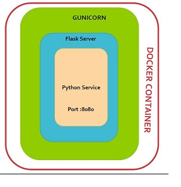

# Connection-Leak detector Microservice

This Microservice detects unclosed database connection in code to prevent connection leak in run time. It use regex patterns to check closed connection pattern if pattern not mached in api it will add that api in open connection leak list. 
This also parse and store open connection leak data in [mongo](https://www.mongodb.com/) db.


## Installation
#### Checkout Repository
```
$git clone https://github.com/swiftops/connectionleak-detector.git
```
### 1. Deploy inside Docker
---
##### Pre-Requisite:
* Docker should be installed on your machine. Refer [Install Docker](https://www.digitalocean.com/community/tutorials/how-to-install-and-use-docker-on-ubuntu-16-04) documentation.
*  Change property file  present in this repository 

    + connleak.ini - to set path of regex, ignore list files and db connection details.
    + connection_Leak_Regex.properties - to chage regex pattern for detecting connection leak in databse
    + Connection_Leak_IgnoreList.properties - to add method in ignore list with its class name. ( If method is returning resultset and it is closed in callig method and it is reported as for open connection leak such method need add in this file )
 
  
##### Steps to start microservice
Once you  done with pre-requisite exeute below command to start connectionleak_catcher microservice
```
docker build -t <image-name>
docker run -p 5004:5004 -v <hostpath for mounting repo>:/app/work/salm_core --name ms-connleakservice -d <image-name>
```
#### To start reference database 
```
docker-compose up --build
```

### 2. On Commit Auto-deploy on specific server.
---
* You need to configure Gitlab Runner to execute Gitlab CI/CD Pipeline. See [Gitlab Config](https://docs.gitlab.com/runner/install)
As soon as you configure runner auto deployment will start as you commited the code in repository.
refer .gitlab-ci.yml file.


### 3. Deploy on local environment.
----
#### Pre-Requisite
* Python 3.6.0
* MongoDB
* Change property file  present in this repository 
    
    + connleak.ini - to set path of regex, ignore list files and db connection details.
    + connection_Leak_Regex.properties - to chage regex pattern for detecting connection leak in databse
    + Connection_Leak_IgnoreList.properties - to add method in ignore list with its class name. ( If method is returning resultset and it is closed in callig method and it is reported as for open connection leak such method need add in this file )  

#### Create Virtual Environment
Virtualenv is the easiest and recommended way to configure a custom Python environment for your services.
To install virtualenv execute below command:
```sh
$pip3 install virtualenv
```
You can check version for virtual environment version by typing below command:
```sh
$virtualenv --version
```
Create a virtual environment for a project:
```
$ cd my_project_folder
$ virtualenv virtenv
```
virtualenv `virtenv` will create a folder in the current directory which will contain the Python executable files, and a copy of the pip library which you can use to install other packages. The name of the virtual environment (in this case, it was `virtenv`) can be anything; omitting the name will place the files in the current directory instead.

This creates a copy of Python in whichever directory you ran the command in, placing it in a folder named `virtenv`.

You can also use the Python interpreter of your choice (like python3.6).
```
$virtualenv -p /usr/bin/python3.6 virtenv
```
To begin using the virtual environment, it needs to be activated:
```
$ source virtenv/bin/activate
```
The name of the current virtual environment will now appear on the left of the prompt (e.g. (virtenv)Your-Computer:your_project UserName$) to let you know that it’s active. From now on, any package that you install using pip will be placed in the virtenv folder, isolated from the global Python installation. You can add python packages needed in your microservice development within virtualenv. 

#### Install python module dependanceies
```
pip install -r requirements.txt
```
#### To start microservice 
```
python services.py
```

#### To start reference database 
```
docker-compose up --build
```

#### To Acess microservice
```
http://<your-ip>:5004/api/connectionleak/v1/findConnectionLeak
http://<your-ip>:5004/api/get_nightly_conndata
```

## services

This services detects connection leak in code for give code base path in connection_Leak_Regex.properties file.

```http
[POST] /api/connectionleak/v1/findConnectionLeak
```


Parse connectionleak logs and connectionk leaks list mongo database.

```http
[POST] /api/get_nightly_conndata
```

#### Parameters

| Parameter | in  | Type | Description |
| :--- | :--- | :--- | :--- |
| `REL_NO` | header | `string` | **Required**. Product Release Number e.g  4.5.0 |
| `BUILD_NO` | header | `string` | **Required**. Product Release Number e.g  19 |
| logs | body | `string` | **Required**.  connectionleak logs |

#### Status Codes
 returns the following status codes in  API:

| Status Code | Description |
| :--- | :--- |
| 200 | `OK` |
| 400 | `BAD REQUEST` |
| 404 | `NOT FOUND` |
| 500 | `INTERNAL SERVER ERROR` |


### Architechture


##### Flask
[Flask](http://flask.pocoo.org/docs/1.0/quickstart/) is a micro web framework written in Python. It is classified as a microframework because it does not require particular tools or libraries.It has no database abstraction layer, form validation, or any other components where pre-existing third-party libraries provide common functions. However, Flask supports extensions that can add application features as if they were implemented in Flask itself.


##### Gunicorn
The [Gunicorn](http://docs.gunicorn.org/en/stable/configure.html) "Green Unicorn" (pronounced gee-unicorn)[2] is a Python Web Server Gateway Interface (WSGI) HTTP server. 

###### Features
* Natively supports WSGI, web2py, Django and Paster
* Automatic worker process management
* Simple Python configuration
* Multiple worker configurations
* Various server hooks for extensibility
* Compatible with Python 2.6+ and Python 3.2+[4]


##### Docker 
Docker is Container platform,more deails about [Docker](https://www.docker.com/get-started)


